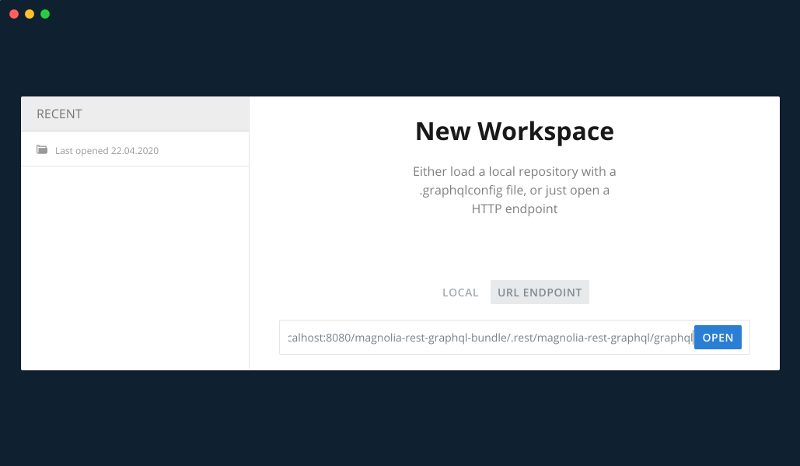
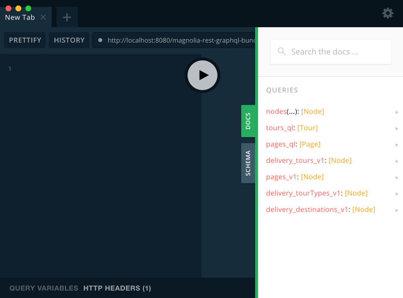
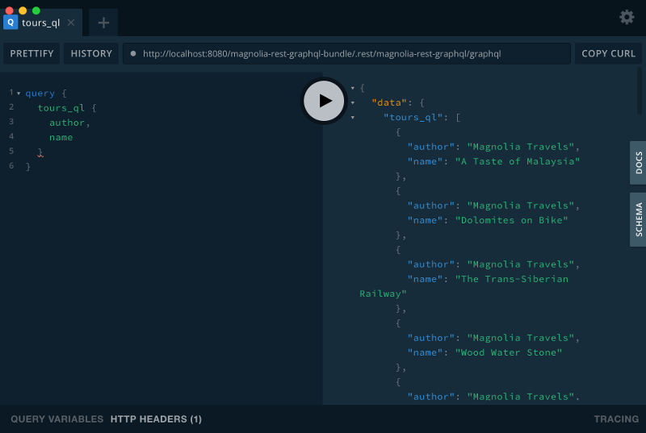
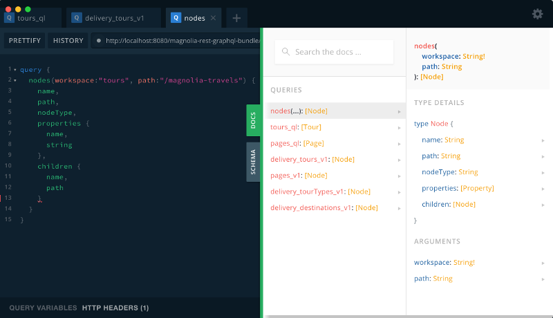
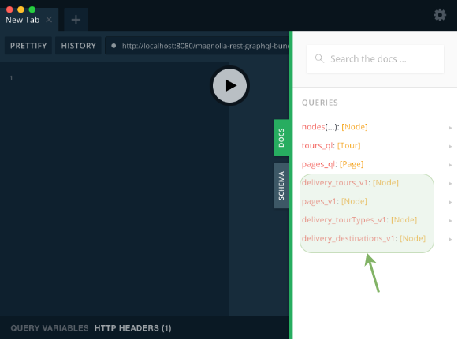
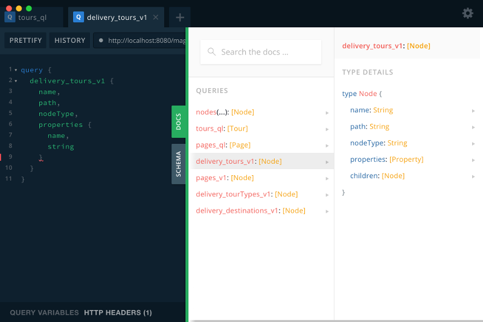

# magnolia-rest-graphql
Module of Magnolia CMS that exposes contents of magnolia using the specification of GraphQL.  
It converts Magnolia CMS in a GraphQL Server.
> I recommend to read the specification of [GraphQL](https://graphql.org/)  

## Features
- Implementation of GraphQL server in Magnolia.
- Configuration of GraphQL schemas as resources of Magnolia.
- Transformation of Delivery endpoints to GraphQL schemas.
- Based on the amazing GraphQL implementation [graphql-java](https://www.graphql-java.com/)

## Installation
Add maven dependency in the project of the magnolia bundle
```
<!-- magnolia-rest-graphql -->
<dependency>
    <groupId>com.formentor</groupId>
    <artifactId>magnolia-rest-graphql</artifactId>
    <version>${magnolia-rest-graphql.version}</version>
</dependency>
```
## Usage
Create GraphQL schemas as resources of Magnolia.  
Resources must be located in the folder **/graphqls** of a light-module or java module

#### Example
/graphqls/schema-tours.graphqls
```
directive @definition(workspace : String!, rootPath : String, nodeTypes : [String]) on FIELD_DEFINITION

schema {
    query: Query,
}

type Query {
    tours_ql : [Tour] @definition(workspace: "tours", rootPath: "/magnolia-travels", nodeTypes: ["mgnl:content"])
}

type Tour {
    author: String,
    body: String,
    description: String,
    duration: Int,
    isFeatured: Boolean,
    location: String,
    name: String
}
```

GraphQL is available at this url:  
#### /.rest/magnolia-rest-graphql/graphql

Use [GraphQL Playground](https://github.com/prisma-labs/graphql-playground) or similar to execute queries.
1. Open the url of Magnolia from GraphQL Playground

2. Check the schema in the docs tab

3. Launch queries to Magnolia


## Query nodes
The query includes the field Nodes that allows to make the same queries as the endpoint **/.rest/nodes/v1/{workspace}/{path}**
#### Fields
- **name** to get the name of the JCR Node.
- **path** to get the path of the JCR Node.
- **nodeType** to get the node type of the JCR Node.
- **children** to get the children nodes.

**Example of query**
```
query {
  nodes(workspace:"tours", path:"/magnolia-travels") {
    name,
    path,
    nodeType,
    properties {
      name,
      string
    },
    children {
      name,
      path
    }
  }
}
```
## Delivery endpoints as GraphQL resources
The delivery endpoints are available as fields inside the Query type and the name of the field is the url of the delivery endpoint replacing "/" by "_".  
For example the delivery endpoint **/.rest/delivery/tours/v1** will be named **delivery_tours_v1**


The fields available to queries mapped with delivery endpoints can be checked at the schema:

#### Fields
- *name* to get the name of the JCR Node.
- *path* to get the path of the JCR Node.
- *nodeType* to get the node type of the JCR Node.
- *children* to get the children nodes.

#### Example of query
```
query {
  delivery_tours_v1 {
    name,
    path,
    nodeType,
    properties {
      name,
      string
    }
  }
}
```
## Caveats